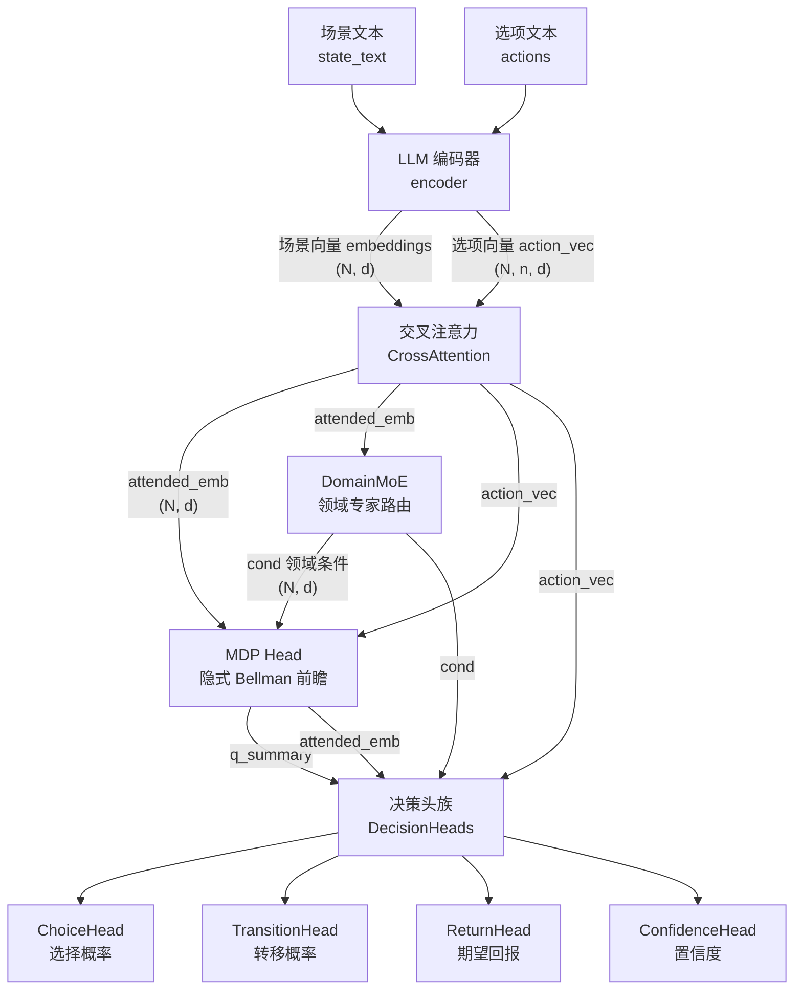
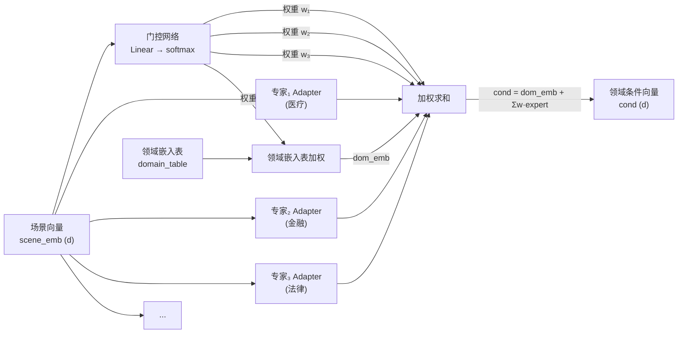
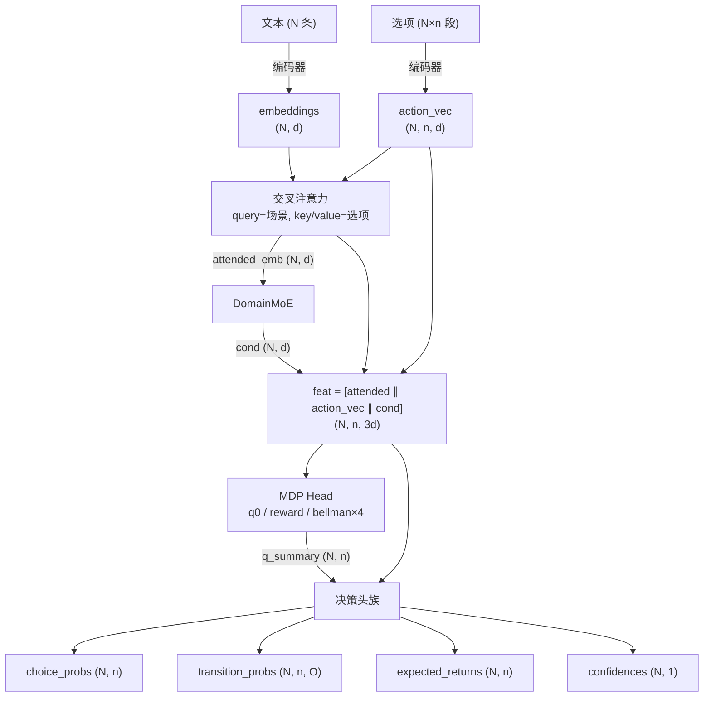
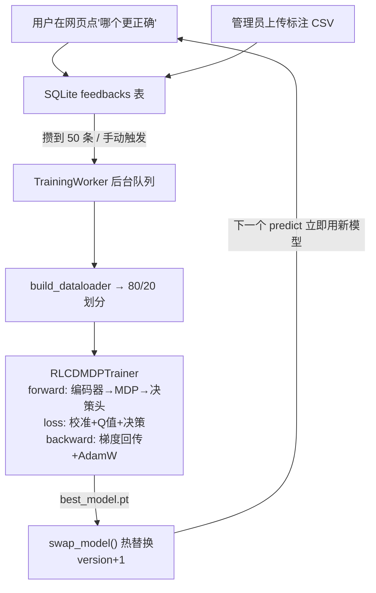

# 域策 DomSense

> **专注垂类决策的 MDP + 领域专家引擎**

> 🤗 **预训练模型已开源到 Hugging Face**：[LIJINGHAI111/DomSense](https://huggingface.co/LIJINGHAI111/DomSense)
>
> 一行代码加载：`model = SystemOneModelForDecision.from_pretrained("LIJINGHAI111/DomSense")`

把"选哪个"这种**闭集决策问题**建模为马尔可夫决策过程（MDP），在隐空间做 Bellman 前瞻，并通过**领域专家混合（MoE）**让不同垂类（医疗/金融/法律/教育…）各有专属专家，避免跨领域训练互相干扰。模型对外只暴露简洁的下一步决策——选哪个、概率多少、会怎样、回报几何、有多大把握。

---

## 一、创作思维：为什么做这个

### 1.1 痛点：通用大模型不懂"专业地选"

生活中大量决策不是"自由发挥"，而是**从有限选项里挑一个最优**：

- 医疗：发烧了，"吃退烧药 / 去医院 / 多喝水"选哪个？
- 金融：手里有笔钱，"买股票 / 存银行 / 买基金"选哪个？
- 法律：收到律师函，"应诉 / 和解 / 忽略"选哪个？

通用大模型（LLM）擅长开放式生成，但在**闭集决策**上有三个硬伤：

| 痛点 | 表现 |
|------|------|
| **不校准** | 输出的概率是"语言流畅度"，不是"真实胜率"，敢说但不准 |
| **无前瞻** | 只看当下一句话，不会"想一步：选了 A 接下来会怎样" |
| **跨域干扰** | 医疗和金融的数据混在一起训，金融的"高风险高回报"逻辑会污染医疗的"安全第一"判断 |

### 1.2 思路：把决策当成"下棋"

下棋时，好的棋手会想："我下这步 → 对手可能下那步 → 我再下…"，每步都有**胜率**。决策也是一样：

```
选动作 a  →  转移到某种结果 s'  →  得到奖励 R  →  再选下一步…
```

这就是**马尔可夫决策过程（MDP）**。核心方程叫 **Bellman 最优方程**：

```
Q*(s, a) = R(s, a) + γ · Σ P(s'|s,a) · max_{a'} Q(s', a')
```

> 💡 人话：**一个动作的价值 = 当下奖励 + 未来最好那条路的价值（打折后）**。

我们让模型在隐空间里"脑补"几步 Bellman 迭代，得到每个选项的 Q 值，再据此决策。这就是项目名里 **MDP** 的由来。

### 1.3 关键设计：领域专家 MoE

医疗决策和金融决策的"价值观"完全不同：
- 医疗：**安全优先**，副作用比疗效更重要
- 金融：**收益风险权衡**，可以接受一定风险换高回报

如果用同一个模型同时学这两个领域，会出现**负迁移**——金融的"激进"会污染医疗的"保守"。

解决方案是**领域专家混合（Mixture of Experts, MoE）**：

```
共享底座（编码器 + 交叉注意力）   ← 所有领域共用，学"通用语义"
        │
        ├── 医疗专家 Adapter  ← 只学医疗领域的"判断偏移"
        ├── 金融专家 Adapter  ← 只学金融领域的"判断偏移"
        ├── 法律专家 Adapter
        └── …（每个垂类一个轻量专家）
```

门控网络根据场景自动选择激活哪些专家，领域之间互不干扰。这就是 **DomSense（Domain Sense）**——**领域感知**的决策引擎。

---

## 二、模型设计思维

### 2.1 统一框架：一个模型解决三件事

传统做法需要三个模型：一个预测结果、一个预测价值、一个做选择。我们用**一个模型**同时输出：

| 输出 | 含义 | 数学对象 |
|------|------|----------|
| `transition_probs` | 选 a 后会发生什么 | 转移概率 P(s'|s,a) |
| `expected_returns` | 选 a 值多少 | Q 值 Q(s,a) |
| `choice_probs` | 该选哪个 | 决策概率 π(a|s) |
| `confidence` | 有多大把握 | 置信度 c(s) |

一次前向全部算出，三个头共享同一个场景-动作特征 `feat[a]`。

### 2.2 隐式前瞻：不展开状态树

教科书的 MDP 需要枚举所有未来状态，但现实中状态空间巨大。我们的做法：

- 用一个 MLP（`bellman_mlp`）**直接学 Bellman 更新量** `δ`，而不是显式算 `R + γ·P·max Q`
- 迭代 K 步（默认 4）：`Q_{k+1} = Q_k + δ_k`
- 跨动作信息通过 `max_a Q_k` 全局池化汇总，**动作数可变也能工作**

> 就像棋手不必真的下完一局，而是用"直觉"（MLP）评估每步的好坏，反复推演几次。

### 2.3 逐动作打分：动作数可变 + 顺序无关

旧架构硬编码 3 个动作槽位，给 2 个选项要填空、给 4 个要截断。新架构改为**逐动作打分**：

```
对每个动作 a：
    feat[a] = [场景向量 ∥ 动作向量]
    score[a] = MLP(feat[a])
```

- 输入 2 个选项 → 输出 2 个概率；输入 4 个 → 输出 4 个
- 完全没有位置编码（语义模式下），选项任意排列输出完全相同（置换等变）

### 2.4 领域专家 MoE：共享底座 + 领域偏移

每个领域一个轻量 Adapter（不是完整的大模型），由门控网络根据场景语义自动混合：

```
门控权重 = softmax( Linear(场景向量) )                  # 自动判断激活哪些专家
领域条件 cond = Σ(门控权重 × 领域嵌入表) + Σ(门控权重 × 专家输出)

逐动作特征 feat[a] = [场景向量 ∥ 动作向量 ∥ cond]
```

- **完全自动路由**：用户不需要指定领域，门控网络从题目内容自动学习该激活哪些专家
- **共享部分**（编码器、交叉注意力、q0/reward/bellman 主网络）：从旧 checkpoint 直接加载，保留已学知识
- **新增部分**（领域嵌入表、门控、专家 Adapter）：随机初始化，随数据训练

这就是**软迁移**——不破坏已有能力，增量学习新领域。

---

## 三、完整架构

### 3.1 整体架构图



### 3.2 领域 MoE 路由细节



> 注意：没有"领域名"输入——门控网络从场景向量自动决定各专家权重，领域嵌入表也由门控权重加权。

### 3.3 数据形状流（一图看懂维度变化）

记 `N`=批大小，`d`=隐藏维度（默认 128），`n`=运行时动作数（由选项数决定），`O`=结局数（默认 2）。



> ⚠️ `n` 是运行时动作数，**不固定**！输入 2 个选项 → n=2，输入 4 个 → n=4。

---

## 四、数学公式（小白友好版）

> **新手提示**：每节先看"💡一句话"建立直觉，再看公式。

### 4.1 编码器：把文字变成向量

- **💡一句话**：把一句话"翻译"成一串数字（语义向量），让计算机能算。
- **公式**：

离线模式（默认）：
```
emb = mean-pool( Transformer(byte_tokens(text)) ) / ‖·‖₂
```

有网模式：
```
emb = Proj( BERT(text)<[BOS_never_used_51bce0c785ca2f68081bfa7d91973934]> )
```

### 4.2 交叉注意力：让场景"读"选项

- **💡一句话**：场景当着所有选项的面"认真看了每个选项在说什么"。
- **公式**：

```
query = embeddings              # (N, 1, d)  场景
key = value = action_vec        # (N, n, d)  选项
attn = MultiheadAttention(query, key, value)
attended_emb = LayerNorm(attn) + embeddings   # 残差
```

### 4.3 领域 MoE：自动领域路由

- **💡一句话**：模型自己读题，判断"这像哪个领域"，自动调出对应专家的"判断偏移"，**用户不需要选领域**。
- **公式**（[domain_moe.py](src/models/domain_moe.py)）：

```
# 1. 门控：从场景语义自动判断各领域专家的激活程度
gate_weights = softmax( Linear(scene_emb) )   # (N, num_experts)

# 2. 领域向量：用门控权重对领域嵌入表加权求和（完全自动，不查表）
dom_emb = Σ_e  gate_weights[e] · domain_table[e]   # (N, d)

# 3. 专家加权混合
mixed = Σ_e  gate_weights[e] · Expert_e(scene_emb)   # (N, d)

# 4. 领域条件向量
cond = dom_emb + mixed   # (N, d)
```

> 关键：门控网络 `gate` 从场景向量 `scene_emb` 端到端学习"什么场景该激活什么专家"，训练时不需要领域标签，推理时也不需要用户指定领域。

### 4.4 MDP Head：隐空间 Bellman 前瞻

- **💡一句话**：模型在脑子里把"选这个会怎样、接下来咋办"推演 4 步，得出每个选项值不值。
- **公式**（[mdp_head.py](src/models/mdp_head.py)）：

```
# 1. 逐动作特征（含领域条件）
feat[a] = [attended_emb ∥ action_vec[a] ∥ cond]    # (N, n, 3d)

# 2. 初始化 Q 值
q⁰(a) = MLP_q0(feat[a])         # (N, n, O)

# 3. 奖励预测
R(a) = MLP_R(feat[a])           # (N, n)

# 4. K 步隐式 Bellman 迭代
for k = 0..K-1:
    best = max_a qᵏ(a)                  # (N, O)  ← 全局池化，与 n 无关
    δ = MLP_B( feat[a], best )          # (N, n, O)  Bellman 更新量
    qᵏ⁺¹(a) = qᵏ(a) + δ

# 5. 汇总 Q
q_summary(a) = max_o qᴷ(a, o)      # (N, n)
```

> 教科书 Bellman：`Q*(s,a) = R(s,a) + γ·Σ P(s'|s,a)·max_{a'} Q(s',a')`。
> 我们用 `MLP_B` 直接学这个更新，**不展开状态树**，4 步前向搞定。

### 4.5 决策头族：逐动作打分器

- **💡一句话**：每个选项独立构造特征，各自打分——概率、转移、回报各算各的。
- **公式**（[decision_heads.py](src/models/decision_heads.py)）：

```
feat[a] = [attended_emb ∥ action_vec[a] ∥ cond]   # (N, n, 3d)
```

| 头 | 公式 | 输出形状 |
|----|------|----------|
| ChoiceHead | `score[a] = Linear(GELU(Linear(feat[a])))`<br/>`choice_probs = softmax(score)` | `(N, n)` |
| TransitionHead | `P(s'\|s,a) = softmax(MLP_t(feat[a]))` | `(N, n, O)` |
| ReturnHead | `Q(s,a) = MLP_r(feat[a])` | `(N, n)` |
| ConfidenceHead | `conf = sigmoid(MLP_cf(attended_emb))` | `(N, 1)` |

### 4.6 训练损失：三个目标一起教

- **💡一句话**：让模型①转移概率猜得准、②回报猜得准、③选项选得对。
- **公式**（[losses.py](src/training/losses.py)）：

```
L = w₁·L_calib + w₂·L_q + w₃·L_decision

L_calib    = KL( P̂(s'|s,a), P(s'|s,a) )        # 校准损失
L_q        = MSE( Q̂(a), Q(a) )                  # Q 值损失
L_decision = CrossEntropy( choice_logits, a* )   # 决策损失
```

> **RLCD** = Reinforcement Learning（回报）+ Calibrated Decision（校准决策）。

---

## 五、目录结构

```
.
├── config/                      # 配置文件
│   ├── base.yaml                #   基础配置（模型/训练/数据/损失/评测/领域MoE）
│   └── train_rlcd_mdp.yaml      #   覆盖配置（输出目录/步长）
├── src/
│   ├── mdp/                     # MDP 数学框架
│   │   ├── mdp.py               #   MDP 数据结构 + BellmanOperator
│   │   ├── reward.py            #   稀疏/稠密奖励函数
│   │   └── transition.py        #   转移概率估计（KL/Brier/ECE/MCE）
│   ├── models/                  # 模型架构
│   │   ├── encoder.py           #   LLM 编码器（离线 fallback 轻量编码器）
│   │   ├── mdp_head.py          #   ★ 核心：隐式 Bellman 迭代头
│   │   ├── decision_heads.py    #   并行决策头族
│   │   ├── domain_moe.py        #   ★ 领域专家混合（MoE）
│   │   └── system_one_model.py  #   完整模型组装
│   ├── sampler/
│   │   └── parallel_sampler.py  # 并行采样器（一次前向输出全部决策）
│   ├── data/
│   │   ├── synthetic.py         #   自造 MDP 数据生成器
│   │   ├── external.py          #   公开数据集（AG News / TREC）
│   │   └── builder.py           #   数据构建器
│   ├── training/
│   │   ├── losses.py            #   校准 / Q 值 / 决策 联合损失
│   │   └── rlcd_mdp_trainer.py  #   RLCD-MDP 训练器
│   └── eval/
│       ├── calibration.py       #   ECE / MCE 校准指标
│       ├── return_error.py      #   回报预测误差（MAE/RMSE）
│       ├── comparative.py       #   消融对比
│       └── benchmark.py         #   基准评测
├── web/                         # Web 应用
│   ├── backend/                 #   FastAPI 后端
│   └── frontend/                #   独立前端
├── scripts/                     # 脚本
│   ├── train.py                 #   训练入口
│   ├── evaluate.py              #   评测入口
│   ├── serve.ps1                #   启动 Web 服务
│   └── setup_env.ps1            #   环境初始化
├── tests/                       # 单元测试
└── requirements.txt             # 依赖
```

---

## 六、环境要求与安装

### 环境要求

- Python >= 3.10（已在 3.13 验证）
- CPU / GPU 均可运行
- **离线可用**：`hf_offline: true`（默认开启），无需联网

### 安装

```bash
# 1. 创建虚拟环境
python -m venv .venv

# 2. 激活（Windows）
.\.venv\Scripts\activate

# 3. 安装依赖
pip install -r requirements.txt
```

---

## 七、快速开始

### 快速验证（小数据 + 20 步）

```bash
python scripts/train.py --quick_test
```

### 完整训练

```bash
python scripts/train.py --config config/train_rlcd_mdp.yaml
```

### 启动 Web 服务

```bash
.\scripts\serve.ps1
# 打开 http://localhost:8000
```

### 预测示例（无需指定领域，模型自动识别）

```python
import requests

# 医疗场景 —— 模型自动识别为医疗领域，激活医疗专家
r = requests.post("http://localhost:8000/api/v1/predict", json={
    "state_text": "小明头疼发烧，该怎么办？",
    "actions": ["吃退烧药", "去医院", "多喝水"],
})
print(r.json()["choice_probs"])

# 金融场景 —— 模型自动识别为金融领域，激活金融专家
r = requests.post("http://localhost:8000/api/v1/predict", json={
    "state_text": "手里有10万闲钱，该怎么投资？",
    "actions": ["买股票", "存银行", "买基金"],
})
print(r.json()["choice_probs"])   # ← 门控权重与医疗场景不同，自动路由
```

---

## 八、核心配置 (`config/base.yaml`)

### 模型配置

| 配置项 | 说明 | 默认值 |
|--------|------|--------|
| `hidden_dim` | 隐藏维度 | 128 |
| `mdp_hidden_dim` | MLP 隐藏层维度 | 64 |
| `num_bellman_steps` | Bellman 迭代步数 | 4 |
| `num_outcomes` | 结局数 | 2 |
| `max_actions` | 最大动作数（运行时 n ≤ max_actions） | 6 |
| `use_cross_attention` | 启用选项交叉注意力 | true |
| `cross_attn_heads` | 交叉注意力头数 | 4 |
| **`use_domain_experts`** | **启用领域专家 MoE** | **true** |
| **`domains`** | **领域列表** | **医疗/金融/法律/教育/科技/职场/生活/情感** |
| `domain_expert_hidden` | 专家 Adapter 隐藏层维度 | 128 |
| `domain_gate_hidden` | 门控网络隐藏层维度 | 128 |
| `hf_offline` | 离线模式（免下载预训练模型） | true |

### 训练与损失

| 配置项 | 说明 | 默认值 |
|--------|------|--------|
| `training.learning_rate` | 学习率 | 5e-5 |
| `training.batch_size` | 批大小 | 16 |
| `training.gradient_accumulation_steps` | 梯度累积步数 | 2 |
| `loss.calib_weight` | 校准损失权重 w₁ | 1.0 |
| `loss.q_value_weight` | Q 值损失权重 w₂ | 1.0 |
| `loss.decision_weight` | 决策损失权重 w₃ | 1.0 |

---

## 九、Web 应用 · 自动学习闭环

### 页面与接口

| 页面/接口 | 地址 | 说明 |
|-----------|------|------|
| 用户决策页 | `/` | 输入场景 + 选项 → 生成决策 → 点选正确选项反馈 |
| 管理后台 | `/admin` | 模型信息、反馈统计、训练记录 |
| 预测接口 | `POST /api/v1/predict` | 场景 + 选项 → 决策（领域自动识别） |
| 反馈接口 | `POST /api/v1/feedback` | 提交"正确选项"标注 |
| 训练接口 | `POST /api/v1/admin/train` | 手动触发训练 |

### 完整闭环



### 进程模型

- **模型单例**：`ModelManager` 用 `RLock` 保护模型引用；推理 `no_grad()` 且不在锁内
- **训练独立**：`TrainingWorker` 用 daemon 线程 + 队列，训练时构造**全新模型实例**
- **热替换**：训练完成后原子替换模型引用，无需重启

---

## 十、测试与消融

### 测试

```bash
python -m pytest tests/ -v
```

共 **32 个**单元测试，覆盖：MDP 数学框架、Bellman 算子、MDP Head 隐式迭代、逐动作架构（可变动作数 / 置换等变性）、领域 MoE、损失函数、校准指标、并行采样器等。

### 消融实验

| 变体 | 说明 |
|------|------|
| **完整模型（MoE + 交叉注意力）** | 编码器 + MDP Head + 决策头族 + 交叉注意力 + 领域 MoE（1,110,803 参数） |
| 完整模型（纯槽位） | 关闭交叉注意力，用位置嵌入表 |
| `NoMDPHeadModel` | 去掉 MDP Head，保留决策头 |
| `StandardSoftmaxBaseline` | 标准 softmax 分类基线 |

---

## 十一、设计哲学与局限

### 设计哲学

1. **"想说的藏起来，只给要的"**：内部认真推演，对外只给简洁决策
2. **概率天然校准**：输出就是严格概率分布，不是"语言流畅度"
3. **领域隔离**：每个垂类有专属专家，避免负迁移
4. **软迁移**：共享底座可从旧 checkpoint 加载，新领域增量学习

### 已解决的问题

- ✅ 选项个数固定为 3 → 逐动作打分，运行时可变
- ✅ 选项顺序隐含信息 → 语义模式下零位置编码，置换等变
- ✅ 选项不参与语义 → 交叉注意力让选项语义影响决策
- ✅ 跨领域互相干扰 → 领域专家 MoE 隔离

### 当前局限

- ⚠️ **合成数据**：自造数据用于验证架构，真实验证需更多样的标注数据
- ⚠️ **领域差异幅度**：快速训练（20 步）下领域差异较小，需更多数据和步数才能让专家充分分化

---

## 十二、预训练模型

### Hugging Face

模型已开源到 [🤗 LIJINGHAI111/DomSense](https://huggingface.co/LIJINGHAI111/DomSense)，包含：

- `model.safetensors` — 训练好的权重（1,110,803 参数，lightweight 编码器后端）
- `config.json` — 模型配置
- `tokenizer_config.json` — Tokenizer 配置
- 完整的 HF 标准模型代码（`modeling_domsense.py` 等）

#### 安装与加载

```bash
pip install transformers torch
```

```python
from huggingface_repo import SystemOneModelForDecision

model = SystemOneModelForDecision.from_pretrained("LIJINGHAI111/DomSense")
model.eval()

out = model.forward(
    ["患者持续低烧三天伴随咳嗽，请选择下一步处置"],
    action_texts=[["建议自行服药观察", "立即前往发热门诊", "多喝水并休息"]],
)

print(f"选择: 选项{out.choices[0].item() + 1}  置信度={out.confidences[0].item():.4f}")
```

> 详细的 Hugging Face 仓库说明见 [`huggingface_repo/README.md`](huggingface_repo/README.md)。

---

## 十三、参考

详细设计文档：`.trae/documents/jev-mdp-system-one-model-plan.md`
